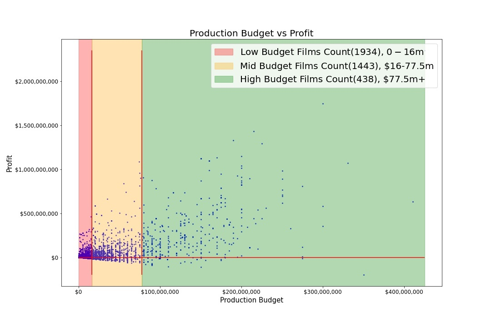
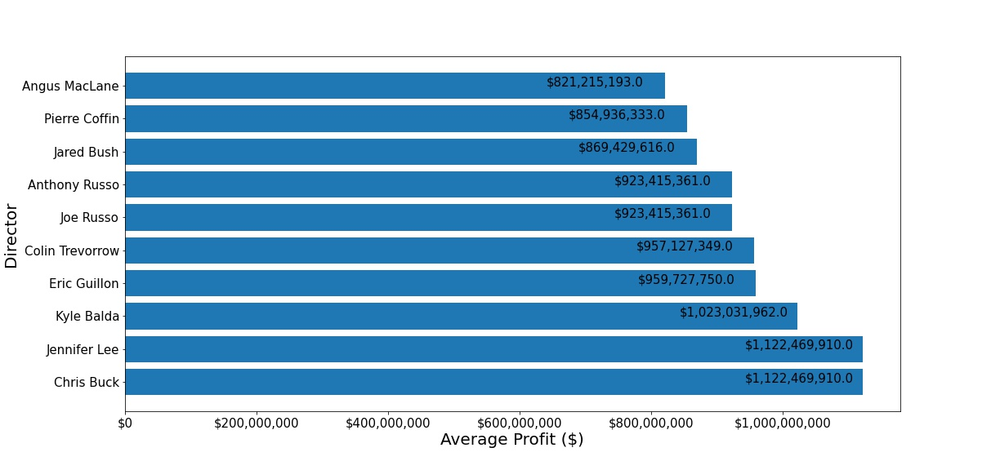

# Box Office Analysis

**Authors**: James Meredith, Johnathan Brown, Samuel Song

## Overview

The purpose of this data analysis project was to explore what types of films are currently doing the best at the box office in order to translate those findings into actionable insights that the head of your company's new movie studio can use to help decide what type of films to create.

## Business Problem

A company (is this not the same as the overview?)

## Data

We have used data from [The Box Office Mojo](https://www.boxofficemojo.com), [Rotten Tomatoes](https://www.rottentomatoes.com), [The Numbers Database](https://www.the-numbers.com), [IMDB](https://www.imdb.com), and [The Movie Database](https://www.themoviedb.org)

## Methods

Our analysis began by cleaning and understanding the databases provided. We have decided that the best approach would be to look at:
- Net Profit
- Budget
- Genres
- Directors
- Run Time

These information were scattered through the databases, so to understand what information came from where:
- IMDB:
    - Base movie info
    - Run Time
    - AKA's (used to separate by regon, want US based only)
    - Directors
- The Numbers DB (TNDB)
    - Budgets
    - Worldwide Profits
- Box Office Mojo (BOM)
    - Worldwide gross

<br>
The Movie Database(TMDB) and Rotten Tomatoes (RT) were opted to not be used. TMDB only had information based on popularity on their website. We found this to be too abstract and a biased representation of movie-goers. RT had good information on ratings, but doing any analysis for ratings was also found to be pointless as ratings are something that occur after a movie is released, and we cannot in any way force a rating onto a show before release. 

<br>

By using IMDB as the main database, we merged together the financial aspects from BOM and TNDB to IMDB by movie title to get a list of movies to analyze. This list is what was used to get top average grossing directors, a list of movies with a net profit/net loss, and runtime vs worldwide gross. 

<br>

**James write about how genre was found/used here**

<br>

Initially in the project, we had more comparisons to consider. But had eventually chosen to abandon these metrics as they were deemed not as worthy to investigate:
- Writer vs net profit (This wasn't used due to time constraints, this is the only one on the list I would also use)
- IMDB Director to ratings
- Genre vs Rating
- Rating (PG, PG-13, R, ...) vs net profit

<br>

Roadblocks encountered were mostly cleaning and dealing with an incomplete datbase. 
- Avatar was being shown as a Japanese horror film
- Titanic was also being shown as a Japanese film
    - Appeared that James Cameron's earlier films (pre Avatar-2) were not in the IMDB database, so merging the financials to IMDB had put together James Cameron's films onto different directors of the same movie name
    - This was remedied by selecting US based movies/directors only. Ultimately this had Titanic and Avatar not selected at all in the final table. 
        - It then apparent that the databases being used were quite incomplete
- Genres were listed in a single column, so intial .groupby methods had yieled anywhere from a single genre to a cluster of three genres. 
    - This did not give us a clear picture of genre distribution
    - Remedied by creating separate columns
    - **JAMES FILL IN HERE HOW IT WAS DONE**

<br>

## Results

We started the project by looking at the top grossing movies overall from google. The list mostly comprised of action/animation films, so we intuitively believed action/animation would do the best.
<br>
Results of the analysis revealed our intuition was mostly correct. Action/Animation were among the top grossing films, and many top directors were animators or action movie directors. 
<br>
Budgeting: It was found that having a lower end budget of $0 to $16 million had only 48% success rate of having a positive. Mid budgets from $16 to $77.5 million had about 65% success rate and high budgets above $77.5 million had 88.6% success rate. Its almost like gambling, spending lower has higher rate of failing. Spending more has a higher rate of success, BUT is not guaranteed success. One should have high confidence in the film if opting for a high budget film. 
- After some googling, there was no concrete answer for what is considered low, mid, high budget films (many different answers were found)
- These numbers for budgeting came from some statistical calculations
- The frequency of the data was extremely skewed right
- Median was only $16m while mean was $32m and standard deviation was $45m!
- One standard deviation to the left yieled a negative budget, which makes no sense
- It was decided to use the median as the cutoff for low budgets, as it may reflect real life standards. More low end budget films should exist.
- $77.5m came from going 1 standard deviation to the right. 
    - To be quite honest I do not know if this was the correct statistical decision
    - In the notebook (EDA CLEANING) there is an attempt at using the Central Limit Theorem to normalize the data
        - The results were extremely weak, which is what led me to not using the CLT metrics
<br>
Runtime: after sectioning off the runtime to three categories of over 120 minutes, 96 minutes to 120 minutes, and below 96 minutes, it was found that the over 120 minutes had the superior average gross in millions. 


### Visualization of budget vs profit


### Visualization of top director average net profit


## Conclusions

Based on the analysis the authors:
- Your budget is personally up to the studio; 
    - lower budget films tend to net a loss profit, but are a low investment compared to other budgets
    - mid budget films have little more than a 1/2 shot of being successful for a more hefty 'buyin'
    - high end budget films are a heavy investment, but tend to succeed more
- Runtime: may be influenced by budget. More budget = more runtime.
    - A higher runtime is shown to have higher gross. The middle and low end have similar results in gross.
- Genres: Action and Animated have proven to be a solid choice to make films of. An addition of sci-fi or fantasy (maybe both??) would most likely be a great supplement.
- Directors: The top net profit directors were mostly comprised of animation or action directors. This may also supplement the above claim of animated/action being the superior choice.

### Next Steps

- Perhaps a functioning CLT to get better budget buckets? Not too sure how important this is.
- Further look into budgets of animated movies vs real-life movies.
    - Maybe animation costs less since don't need to pay for multiple live actors?
    - Maybe better ROI?


## For More Information

Please review our full analysis in our Jupyter Notebook, [eda here](./code/eda_notebook.ipynb), [data cleaning here,](./code/data_cleaning.ipynb) and [our presentation](./presentation.pdf).

For any additional questions, please contact James Meredith at jam637.jlm@gmail.com, Johnathan Brown at **Jonny fill in here** and Samuel Song at samueld.song@gmail.com

## Repository Structure

```
├── code
│   ├── __init__.py
│   ├── visualizations.py
│   ├── data_preparation.py
│   └── eda_notebook.ipynb
├── data
├── images
├── __init__.py
├── README.md
├── box-office-analysis.ipynb
└── presentation.pdf

```
